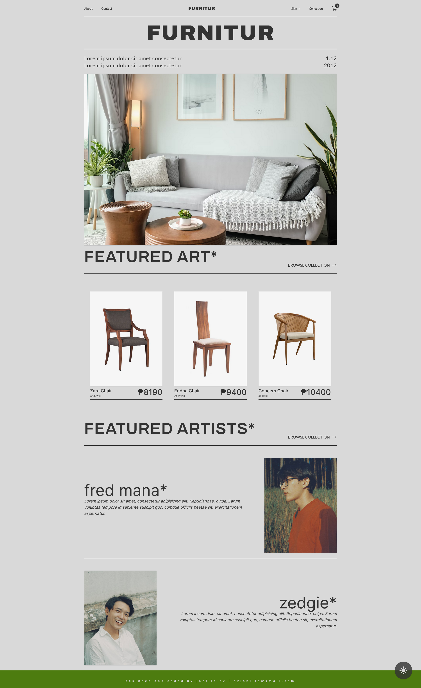
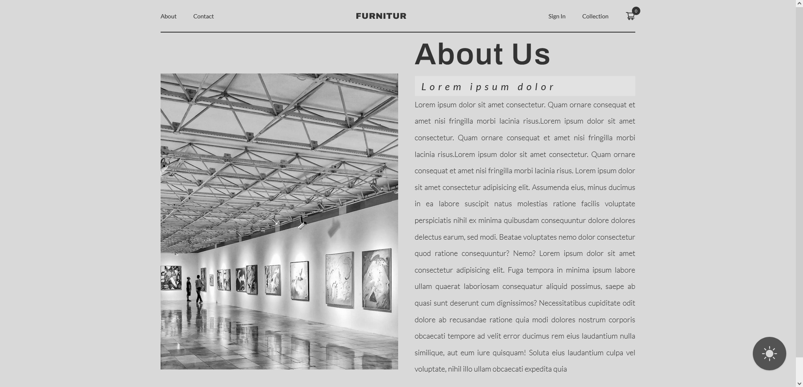
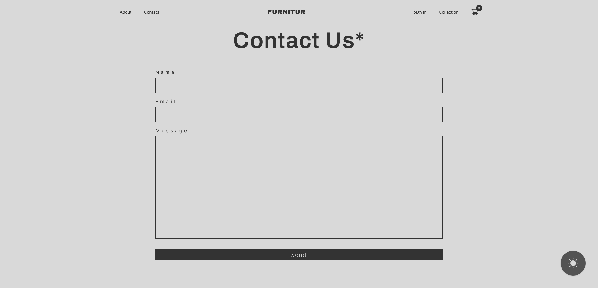
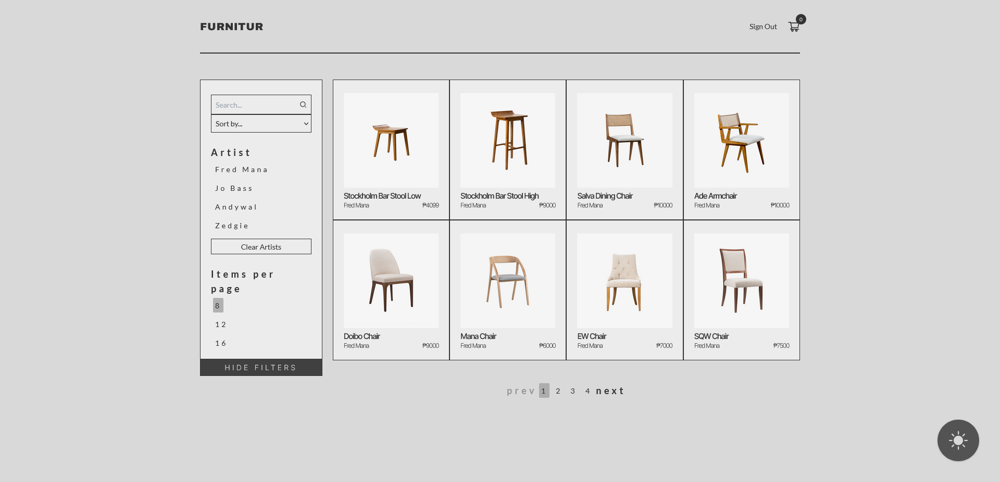
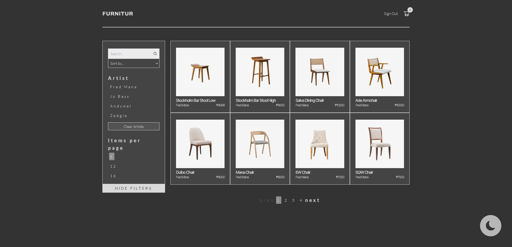
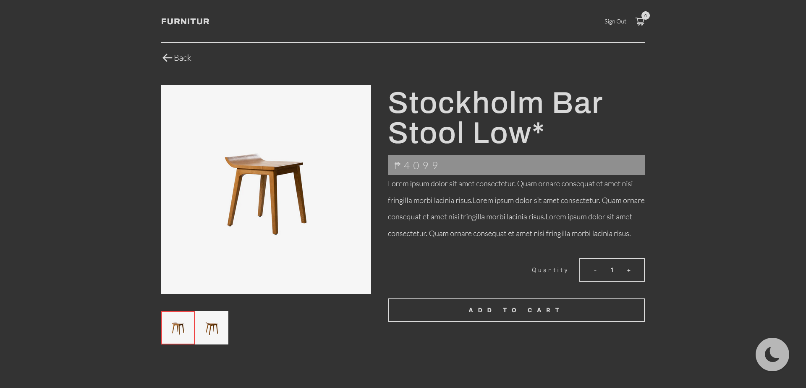

# Furnitur

> This is an unguided website built using,React, Tailwind with Auth0,and offers sorting functionalities to its users. Users can easily sort through a list of items.
>
> Live demo [_here_](https://archstud.netlify.app/).

## Table of Contents

- [Furnitur](#furnitur)
  - [Table of Contents](#table-of-contents)
  - [General Information](#general-information)
  - [Technologies Used](#technologies-used)
  - [Features](#features)
  - [Screenshots](#screenshots)
  - [Contact](#contact)

## General Information

Furnitur is a website built using React as the frontend framework and offers sorting functionalities to its users. Users can easily sort through a list of items based on various criteria such as price, or alphabetical order. The user interface is designed to be intuitive and user-friendly, making it easy for users to navigate and find what they need. The website also uses responsive design, ensuring that it works perfectly on any device, including desktops, mobile phones, and tablets. With its powerful sorting capabilities, this website makes it easy for users to find the information they need quickly and effortlessly.

## Technologies Used

- React
- Tailwind
- Auth0
- CSS
- HTML
- Vite

## Features

- Responsive website layout across multiple devices
- Page and component animations
- Dedicated dark mode that saves your preferences.

## Screenshots

## Contact

> Created by Janille Sy - feel free to contact me!
>
> EMAIL - syjanille@gmail.com
>
> MOBILE - 09268524297
